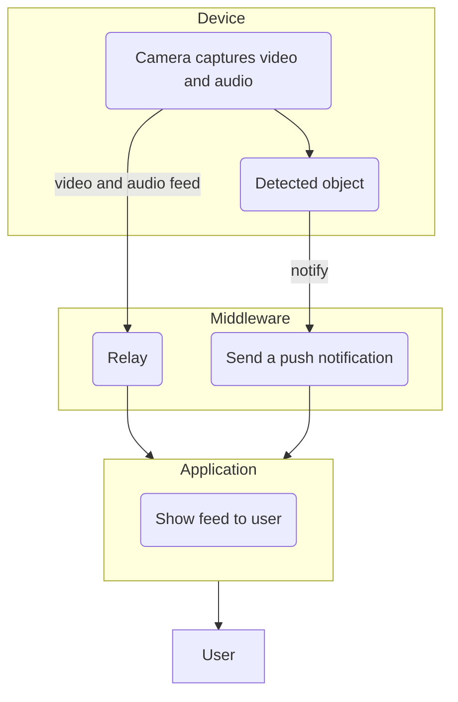
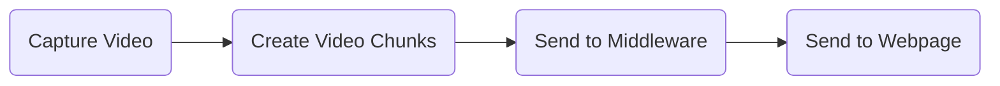

# Raspberry Pi Security Camera


This application turns your Raspberry Pi into an IoT security camera.

Features:
- Send an email when the camera detects a person.
- Show a live feed of the camera on a website.

## Demonstration

https://user-images.githubusercontent.com/72272599/215930372-29606c00-b9ed-4688-b42d-c1fb2a69b741.mp4

## Requirements

For this project you need a:

- A Raspberry Pi 4 (older generations might work as well)
- A Camera Module or a USB webcam
- A server or PC to run the middleware on
- An email account with SMTP access

## Setting up the Hardware

If you're using a camera module, insert the ribbon cable into the CSI (Camera Serial Interface) port. Detailed instructions can be found on the [Raspberry Pi website](https://projects.raspberrypi.org/en/projects/getting-started-with-picamera/2).

If you're using a USB webcam, just plug it into the USB port. Make sure to you use a USB 3.0 port if you're using a USB 3.0 webcam.

## Setting up the Software

This repository consists of two different apps. The device app runs on your Raspberry Pi, and the middleware app can be run on a server or PC. The steps for installing either of these apps are the same. Run the commands in the root directory of the repository.

### Installing Python

This project works on Python 3.10, but newer versions probably work too. The Python installation instructions can be found on the [Python website](https://www.python.org/).

### Installing Dependencies

To run the code you have to install a few third-party dependencies. I recommend first creating and activating a virtual environment for the project to prevent any weird bugs from happening. To do this, run the commands below:

```sh
python3 -m venv venv
source venv/bin/activate
```

Next, install the dependencies using `pip`:

```sh
pip install -r requirements.txt
```

### Configuring Environment Variables

The device and middleware need to know a few parameters in order to function. Rename `.env.example` to `.env` and replace the values with yours.

### Running the Code

Device:

```sh
python3 device
```

Middleware:

```sh
python3 middleware
```

## Motivation

I wanted to experiment and learn more about processing and transporting video. I thought about what kind of projects I could build that involves this topic. I liked the idea of creating a smart security camera because it requires building a video-data pipeline, so that's what I decided to build.

## Process

The first thing I did when starting this project was to think of the features I wanted it to have:

- Send a push notification to the phone of the user when the camera detects a given object.
- Real-time video feed.
- Two-way audio

### ThingSpeak

ThingSpeak is a well-known IoT analytics platform, and I was curious if I could use it for my project. I read through the API documentation and experimented with it. I noticed that ThingSpeak has the feature to create a live image channel, but using it required a paid license[^1] and I don't think it supports audio.

[^1]: https://www.mathworks.com/help/thingspeak/create-an-image-channel.html

### Building my own Middleware

After ThingSpeak didn't work out, I had to think of other options. I realized that the middleware for my project didn't have to do all that much; It just had to relay the video from the Raspberry Pi to a webpage and send push notifications. I didn't have any experience writing web servers in Python before, but I have in other languages, so I decided to take make my own middleware.

A good place to start is to figure out how the data will flow from the device to the webpage.



Looking at this flowchart gave me a few questions:
- How do we capture audio and video?
- How do we detect objects?
- What objects should be detected?
- How does the device notify the middleware when detecting an object?
- How do we send a push notification to the user's phone?
- How do we send the audio and video to the middleware?
- How do we show the live feed to the user?

### Capturing Audio and Video

I first experimented with FFmpeg[^2]. FFmpeg is a powerful solution for capturing and processing audio and video data. I had used FFmpeg's command line tool before and knew that you can use it with programming languages.

I looked for an FFmpeg Python module and found one on GitHub[^3]. I first tried out capturing video from my laptop's camera, which worked fine. It did get a bit tricky when I had to figure out how to capture single video frames. The Python module is an abstraction over the FFmpeg command line tool, so I had to read data from the standard output of the FFmpeg process in order to get this data. This was pretty easy to do when FFmpeg was outputting uncompressed RGB data because the amount of data per frame is always the same for each frame. The audio could be recorded using a separate FFmpeg process, but I didn't focus on that yet at this point. I first wanted to figure out how to detect objects.

[^2]: https://ffmpeg.org/
[^3]: https://github.com/kkroening/ffmpeg-python

### Object Detection

I figured that I need some object detection model to detect objects from the video. After doing a bit of Googling I kept seeing the YOLO model pop up. I read the YOLO documentation and learned that it's an object detection and image segmentation model developed by Ultralytics[^4]. They released version 8 of the model less than a month ago as of writing this, so I decided to use it for my project.

[^4]: https://docs.ultralytics.com/

Implementing the model was pretty simple, yet I had a few issues. Processing the captured video frame was easy; All I had to do was turn the frame bytes into a Numpy array. I ran my code, and the YOLO module started printing what object it detected in the video frame. The issues began when I programmatically wanted to figure out what object was being detected.

When YOLO detects an object, it returns the class integer of the object. For example, if it detects a person it returns a `0`, and the `0` maps to the `person` class. So somewhere there is a list that maps this index to a class I assume. I couldn't find anything about this in the documentation, so I looked in the modules source code where I did find that this list exists but I don't know how to access it[^5]. With trial and error, I figured out that the person class is `0`, so that's the only object that the device can detect.

The object detection takes a little over 500ms to process per frame when using the Pytorch backend, which runs on the Raspberry Pi's CPU. I decided to run the object detection once per second because of this.

[^5]: https://github.com/ultralytics/ultralytics/blob/522f1937edb0728f1fb1ec6398ae56d7f476c3a4/ultralytics/nn/autoshape.py#L134


### Building the Web Server

The web server didn't need many features, so I built the server using [Flask](https://flask.palletsprojects.com/en/2.2.x/) a small, extensible web framework for Python.

### Notifying Middleware

I needed a protocol for communicating between the device and the middleware. One possibility was to implement a REST API, which would be easy to do build using Flask. I instead used [Socket.IO](https://socket.io/) because it allows bidirectional communication and has low latency. When the device detects an object, it sends a "detected" event to the middleware, which can then handle it accordingly.

### Sending Video to the Middleware

A very common protocol for delivering audio and video to the browser is the HTTP Live Streaming (HLS) protocol. This was what I imagined the process to look like:



What protocol could I use to send the data from the device to the middleware? I did a little research and thought that UDP would be fine for this purpose because of its low latency. I couldn't find a straightforward way to do this with Flask, and other solutions would complicate the project a lot and would take a lot of time to implement, so I looked for other ways I could implement live video.

A much simpler solution was possible by sending video frames as JPEGs to the middleware using Sockets.IO. This worked great but doesn't allow for audio streaming and is more inefficient.

### Sending Push Notifications to the Website

One way to send push notifications through a website is by using Push API[^6]. I wrote a bit of code to get this to work, but then I found out that you can only use this if the site is SSL protected, and iOS doesn't support this protocol yet. I decided to go with a simpler email notification system instead. I implemented this with Python's built-in `smtplib` module. The middleware sends an email whenever a person is detected and attaches a snapshot.

[^6]: https://developer.mozilla.org/en-US/docs/Web/API/Push_API

### Replacing FFmpeg with OpenCV

I wanted to clean up the code a bit. I wasn't implementing the audio streaming functionality anymore and thought that the code I wrote for the FFmpeg stuff was a bit messy. I switched FFmpeg for [OpenCV](https://opencv.org/) which made the code a lot cleaner.

### Conclusion

The project didn't go exactly as I hoped and unfortunately couldn't implement all the features I originally wanted to implement. I did however learn a lot about how to create an IoT data pipeline.

Something I could improve in the future is the user experience because as of now, everything has to be configured using environment variables. It would be more user-friendly if these things could be adjusted using the web app. I'd also add two-way audio, and support for more objects.
